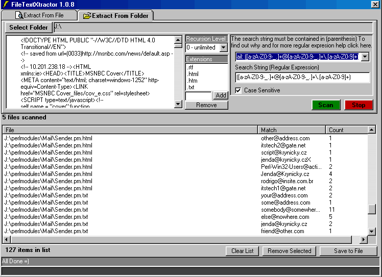



## FileTextXtractor

### Description

Extract Anything from anything. RegExps for email, phone numbers, creditcard#s and more included. Also includes link to regular expresion tutorial.
 
### More Info
 
Requires ref to microsoft scripting runtime and

microsoft regular expresions.

             |
---                |---
**Submitted On**   |2002-04-18 15:40:44
**By**             |[RegX](https://github.com/Planet-Source-Code/PSCIndex/blob/master/ByAuthor/regx.md)
**Level**          |Intermediate
**User Rating**    |5.0 (10 globes from 2 users)
**Compatibility**  |VB 6\.0
**Category**       |[Complete Applications](https://github.com/Planet-Source-Code/PSCIndex/blob/master/ByCategory/complete-applications__1-27.md)
**World**          |[Visual Basic](https://github.com/Planet-Source-Code/PSCIndex/blob/master/ByWorld/visual-basic.md)
**Archive File**   |[FileTextXt733824182002\.zip](https://github.com/Planet-Source-Code/regx-filetextxtractor__1-33902/archive/master.zip)

